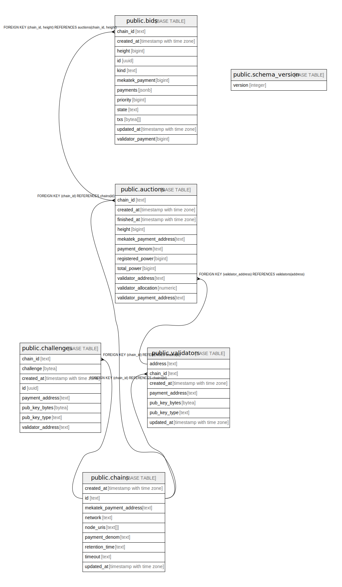

# zenith-dev

## Tables

| Name | Columns | Comment | Type |
| ---- | ------- | ------- | ---- |
| [public.auctions](public.auctions.md) | 11 |  | BASE TABLE |
| [public.bids](public.bids.md) | 12 |  | BASE TABLE |
| [public.chains](public.chains.md) | 9 |  | BASE TABLE |
| [public.challenges](public.challenges.md) | 8 |  | BASE TABLE |
| [public.schema_version](public.schema_version.md) | 1 |  | BASE TABLE |
| [public.validators](public.validators.md) | 7 |  | BASE TABLE |

## Stored procedures and functions

| Name | ReturnType | Arguments | Type |
| ---- | ------- | ------- | ---- |
| public.uuid_nil | uuid |  | FUNCTION |
| public.uuid_ns_dns | uuid |  | FUNCTION |
| public.uuid_ns_url | uuid |  | FUNCTION |
| public.uuid_ns_oid | uuid |  | FUNCTION |
| public.uuid_ns_x500 | uuid |  | FUNCTION |
| public.uuid_generate_v1 | uuid |  | FUNCTION |
| public.uuid_generate_v1mc | uuid |  | FUNCTION |
| public.uuid_generate_v3 | uuid | namespace uuid, name text | FUNCTION |
| public.uuid_generate_v4 | uuid |  | FUNCTION |
| public.uuid_generate_v5 | uuid | namespace uuid, name text | FUNCTION |

## Relations

---

> Generated by [tbls](https://github.com/k1LoW/tbls)
