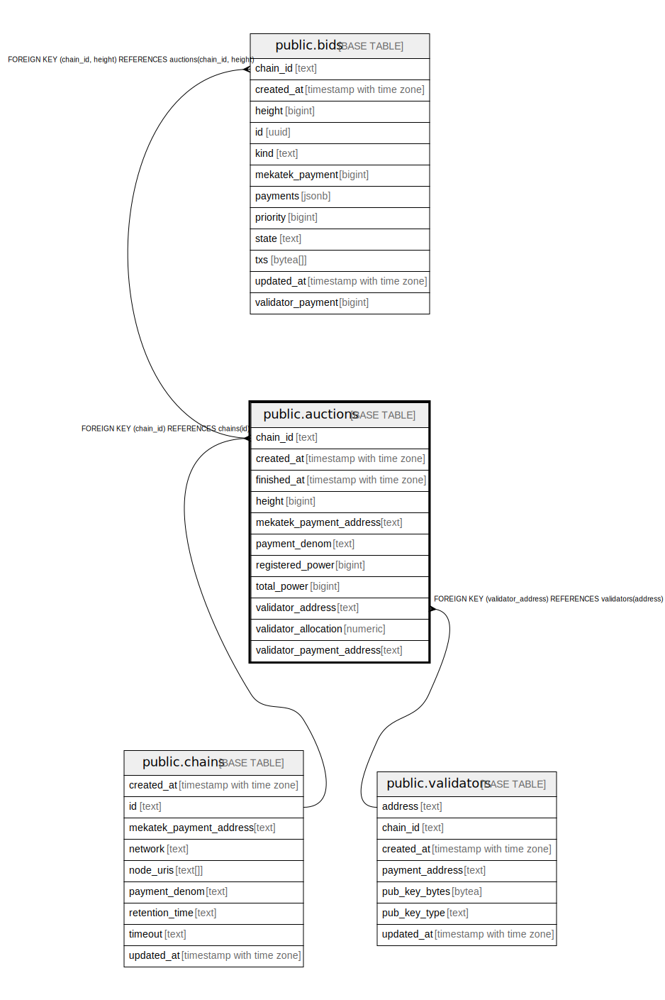

# public.auctions

## Description

## Columns

| Name | Type | Default | Nullable | Children | Parents | Comment |
| ---- | ---- | ------- | -------- | -------- | ------- | ------- |
| chain_id | text |  | false | [public.bids](public.bids.md) | [public.chains](public.chains.md) |  |
| created_at | timestamp with time zone | now() | false |  |  |  |
| finished_at | timestamp with time zone |  | true |  |  |  |
| height | bigint |  | false | [public.bids](public.bids.md) |  |  |
| mekatek_payment_address | text |  | false |  |  |  |
| payment_denom | text |  | false |  |  |  |
| registered_power | bigint |  | true |  |  |  |
| total_power | bigint |  | true |  |  |  |
| validator_address | text |  | false |  | [public.validators](public.validators.md) |  |
| validator_allocation | numeric |  | false |  |  |  |
| validator_payment_address | text |  | false |  |  |  |

## Constraints

| Name | Type | Definition |
| ---- | ---- | ---------- |
| auctions_chain_id_fkey | FOREIGN KEY | FOREIGN KEY (chain_id) REFERENCES chains(id) |
| auctions_chain_id_not_empty | CHECK | CHECK ((chain_id <> ''::text)) |
| auctions_mekatek_payment_address_not_empty | CHECK | CHECK ((mekatek_payment_address <> ''::text)) |
| auctions_payment_denom_not_empty | CHECK | CHECK ((payment_denom <> ''::text)) |
| auctions_pkey | PRIMARY KEY | PRIMARY KEY (chain_id, height) |
| auctions_validator_address_fkey | FOREIGN KEY | FOREIGN KEY (validator_address) REFERENCES validators(address) |
| auctions_validator_address_not_empty | CHECK | CHECK ((validator_address <> ''::text)) |
| auctions_validator_payment_address_not_empty | CHECK | CHECK ((validator_payment_address <> ''::text)) |

## Indexes

| Name | Definition |
| ---- | ---------- |
| auctions_finished_at_idx | CREATE INDEX auctions_finished_at_idx ON public.auctions USING btree (finished_at) |
| auctions_pkey | CREATE UNIQUE INDEX auctions_pkey ON public.auctions USING btree (chain_id, height) |

## Relations

---

> Generated by [tbls](https://github.com/k1LoW/tbls)
