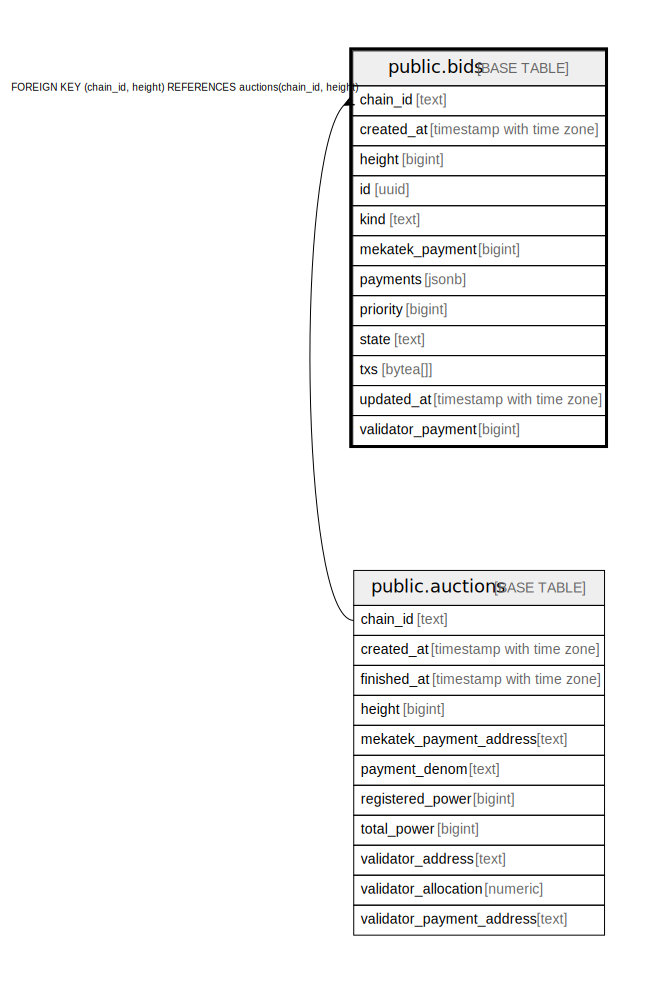

# public.bids

## Description

## Columns

| Name | Type | Default | Nullable | Children | Parents | Comment |
| ---- | ---- | ------- | -------- | -------- | ------- | ------- |
| chain_id | text |  | false |  | [public.auctions](public.auctions.md) |  |
| created_at | timestamp with time zone | now() | false |  |  |  |
| height | bigint |  | false |  | [public.auctions](public.auctions.md) |  |
| id | uuid |  | false |  |  |  |
| kind | text |  | false |  |  |  |
| mekatek_payment | bigint |  | false |  |  |  |
| payments | jsonb |  | false |  |  |  |
| priority | bigint |  | false |  |  |  |
| state | text |  | false |  |  |  |
| txs | bytea[] |  | false |  |  |  |
| updated_at | timestamp with time zone | now() | false |  |  |  |
| validator_payment | bigint |  | false |  |  |  |

## Constraints

| Name | Type | Definition |
| ---- | ---- | ---------- |
| bids_chain_id_height_fkey | FOREIGN KEY | FOREIGN KEY (chain_id, height) REFERENCES auctions(chain_id, height) |
| bids_chain_id_not_empty | CHECK | CHECK ((chain_id <> ''::text)) |
| bids_height_not_zero | CHECK | CHECK ((height <> 0)) |
| bids_kind_not_empty | CHECK | CHECK ((kind <> ''::text)) |
| bids_pkey | PRIMARY KEY | PRIMARY KEY (id) |
| bids_txs_not_empty | CHECK | CHECK ((array_length(txs, 1) <> 0)) |

## Indexes

| Name | Definition |
| ---- | ---------- |
| bids_created_at_idx | CREATE INDEX bids_created_at_idx ON public.bids USING btree (created_at) |
| bids_pkey | CREATE UNIQUE INDEX bids_pkey ON public.bids USING btree (id) |

## Relations

---

> Generated by [tbls](https://github.com/k1LoW/tbls)
