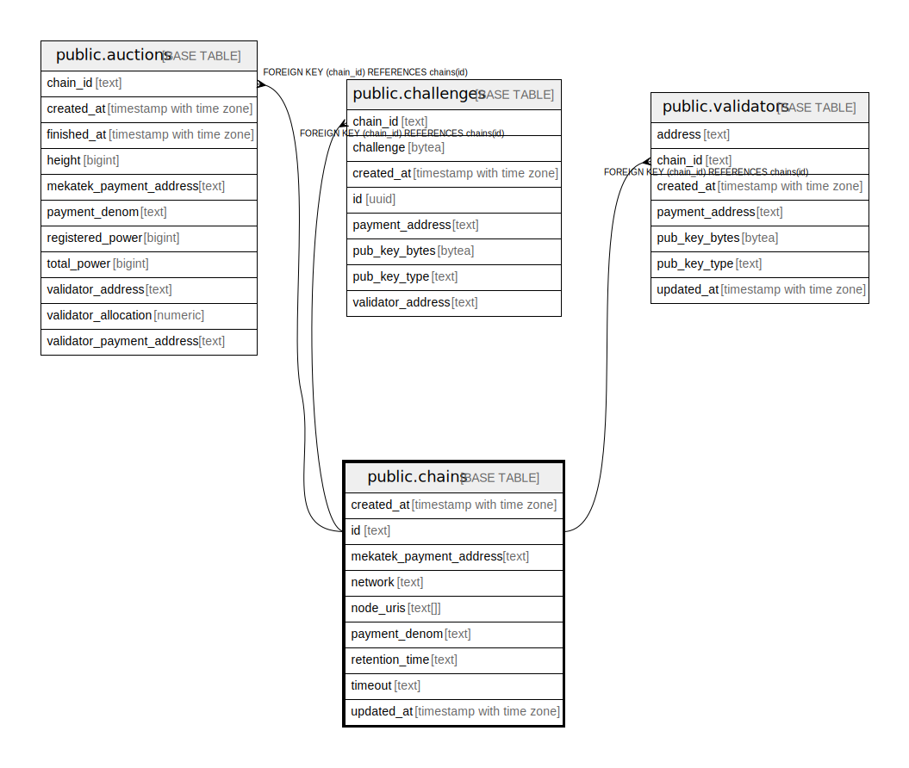

# public.chains

## Description

## Columns

| Name | Type | Default | Nullable | Children | Parents | Comment |
| ---- | ---- | ------- | -------- | -------- | ------- | ------- |
| created_at | timestamp with time zone | now() | false |  |  |  |
| id | text |  | false | [public.auctions](public.auctions.md) [public.challenges](public.challenges.md) [public.validators](public.validators.md) |  |  |
| mekatek_payment_address | text |  | false |  |  |  |
| network | text |  | false |  |  |  |
| node_uris | text[] | '{}'::text[] | false |  |  |  |
| payment_denom | text |  | false |  |  |  |
| retention_time | text |  | true |  |  |  |
| timeout | text | '1s'::text | false |  |  |  |
| updated_at | timestamp with time zone | now() | false |  |  |  |

## Constraints

| Name | Type | Definition |
| ---- | ---- | ---------- |
| chains_id_not_empty | CHECK | CHECK ((id <> ''::text)) |
| chains_mekatek_payment_address_not_empty | CHECK | CHECK ((mekatek_payment_address <> ''::text)) |
| chains_network_not_empty | CHECK | CHECK ((network <> ''::text)) |
| chains_pkey | PRIMARY KEY | PRIMARY KEY (id) |

## Indexes

| Name | Definition |
| ---- | ---------- |
| chains_pkey | CREATE UNIQUE INDEX chains_pkey ON public.chains USING btree (id) |

## Relations

---

> Generated by [tbls](https://github.com/k1LoW/tbls)
