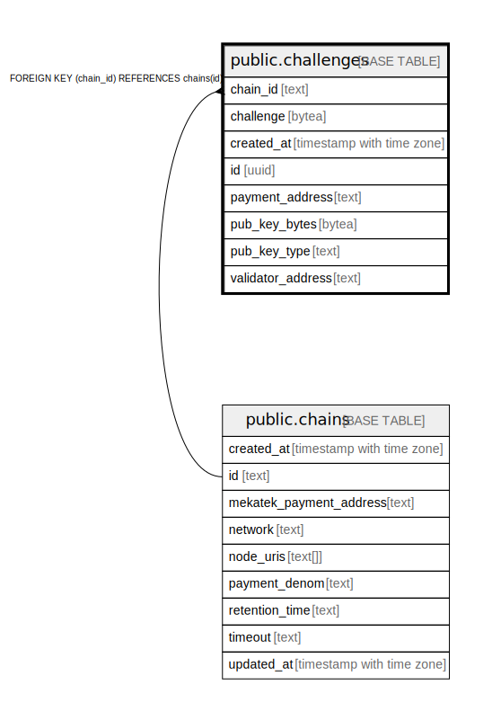

# public.challenges

## Description

## Columns

| Name | Type | Default | Nullable | Children | Parents | Comment |
| ---- | ---- | ------- | -------- | -------- | ------- | ------- |
| chain_id | text |  | false |  | [public.chains](public.chains.md) |  |
| challenge | bytea |  | false |  |  |  |
| created_at | timestamp with time zone | now() | false |  |  |  |
| id | uuid |  | false |  |  |  |
| payment_address | text |  | false |  |  |  |
| pub_key_bytes | bytea |  | false |  |  |  |
| pub_key_type | text |  | false |  |  |  |
| validator_address | text |  | false |  |  |  |

## Constraints

| Name | Type | Definition |
| ---- | ---- | ---------- |
| challenges_chain_id_fkey | FOREIGN KEY | FOREIGN KEY (chain_id) REFERENCES chains(id) |
| challenges_chain_id_not_empty | CHECK | CHECK ((chain_id <> ''::text)) |
| challenges_challenge_not_empty | CHECK | CHECK ((length(challenge) <> 0)) |
| challenges_payment_address_not_empty | CHECK | CHECK ((payment_address <> ''::text)) |
| challenges_pkey | PRIMARY KEY | PRIMARY KEY (id) |
| challenges_pub_key_bytes_not_empty | CHECK | CHECK ((length(pub_key_bytes) <> 0)) |
| challenges_pub_key_type_not_empty | CHECK | CHECK ((pub_key_type <> ''::text)) |
| challenges_validator_address_not_empty | CHECK | CHECK ((validator_address <> ''::text)) |

## Indexes

| Name | Definition |
| ---- | ---------- |
| challenges_pkey | CREATE UNIQUE INDEX challenges_pkey ON public.challenges USING btree (id) |

## Relations

---

> Generated by [tbls](https://github.com/k1LoW/tbls)
