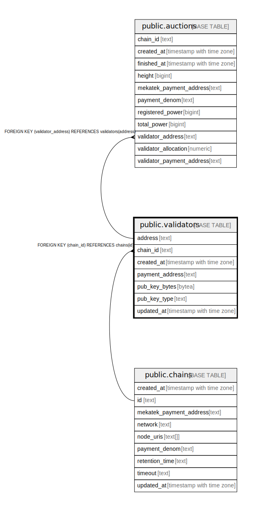

# public.validators

## Description

## Columns

| Name | Type | Default | Nullable | Children | Parents | Comment |
| ---- | ---- | ------- | -------- | -------- | ------- | ------- |
| address | text |  | false | [public.auctions](public.auctions.md) |  |  |
| chain_id | text |  | false |  | [public.chains](public.chains.md) |  |
| created_at | timestamp with time zone | now() | false |  |  |  |
| payment_address | text |  | false |  |  |  |
| pub_key_bytes | bytea |  | false |  |  |  |
| pub_key_type | text |  | false |  |  |  |
| updated_at | timestamp with time zone | now() | false |  |  |  |

## Constraints

| Name | Type | Definition |
| ---- | ---- | ---------- |
| validators_address_key | UNIQUE | UNIQUE (address) |
| validators_address_not_empty | CHECK | CHECK ((address <> ''::text)) |
| validators_chain_id_fkey | FOREIGN KEY | FOREIGN KEY (chain_id) REFERENCES chains(id) |
| validators_chain_id_not_empty | CHECK | CHECK ((chain_id <> ''::text)) |
| validators_payment_address_not_empty | CHECK | CHECK ((payment_address <> ''::text)) |
| validators_pkey | PRIMARY KEY | PRIMARY KEY (chain_id, address) |
| validators_pub_key_bytes_not_empty | CHECK | CHECK ((length(pub_key_bytes) <> 0)) |
| validators_pub_key_type_not_empty | CHECK | CHECK ((pub_key_type <> ''::text)) |

## Indexes

| Name | Definition |
| ---- | ---------- |
| validators_address_key | CREATE UNIQUE INDEX validators_address_key ON public.validators USING btree (address) |
| validators_pkey | CREATE UNIQUE INDEX validators_pkey ON public.validators USING btree (chain_id, address) |

## Relations

---

> Generated by [tbls](https://github.com/k1LoW/tbls)
